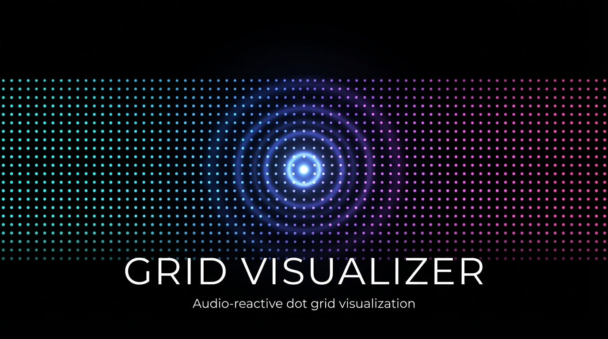

<p align="center">
  
</p>

<p align="center">
  <strong>An audio-reactive dot grid visualization with physics-driven animation</strong>
</p>

<p align="center">
  <a href="https://github.com/Keshav-Madhav/grid-visualizer/releases/latest"></a>
  <a href="https://github.com/Keshav-Madhav/grid-visualizer/blob/main/LICENSE"></a>
  
  
</p>

---

Grid Visualizer renders an infinite field of dots that react to audio, mouse input, and mathematical wave functions in real time. Built with WebGL for GPU-accelerated rendering of 500K+ dots at 60fps.

## Install

### Download

Grab the latest release for your platform:

| Platform | Download |
|----------|----------|
| macOS (Universal) | [`.dmg`](https://github.com/Keshav-Madhav/grid-visualizer/releases/latest) |
| Windows | [`.exe` installer](https://github.com/Keshav-Madhav/grid-visualizer/releases/latest) |
| Linux | [`.AppImage`](https://github.com/Keshav-Madhav/grid-visualizer/releases/latest) |

### Build from source

```bash
git clone https://github.com/Keshav-Madhav/grid-visualizer.git
cd grid-visualizer
npm install
npm start
```

To build native audio capture binaries on macOS:

```bash
npm run build:native
```

## Features

### Wave Modes

Switch modes with keys `0`-`9`:

| Key | Mode | Description |
|-----|------|-------------|
| `1` | Ripple | Concentric rings expanding from origin |
| `2` | Spiral | Logarithmic spiral patterns |
| `3` | Vortex | Rotating radial distortions |
| `4` | Interference | Superimposed wave patterns |
| `5` | Dipole | Dual opposite-phase wave sources |
| `6` | Drift | Smooth flow-field distortions |
| `7` | Gravity | Central attractor pulling dots inward |
| `8` | Rain | Falling dot patterns |
| `9` | Noise Field | Perlin-noise organic movement |
| `0` | Type | Text input — dots arrange around typed text |

### Audio Reactivity

- **Microphone** — real-time audio input visualization
- **System audio** — native screen capture audio on macOS via ScreenCaptureKit
- **Beat detection** — energy-spike detection with visual pulse
- **Multi-band analysis** — bass, mids, treble tracked independently
- **Band mapping** — radial, left-right, or top-bottom frequency visualization
- **Now Playing** — auto-displays current track from system media

Toggle with `Space` to cycle: off → mic → system audio.

### Color Themes

Cycle through 8 themes with `C`:

**Aurora** · **Ocean** · **Fire** · **Neon** · **Mono** · **Pastel** · **Sunset** · **Matrix**

### Physics Engine

- Spring physics (underdamped, K=28) for snappy dot return
- Neighbor repulsion between adjacent dots
- Mouse force field — dots repel from cursor
- Sleep optimization — inactive dots freeze to save CPU

### Desktop Features

- **Wallpaper mode** — render behind desktop icons (`Ctrl+Shift+W`)
- **Transparent window** — toggle with `T`
- **System tray** — minimize to tray with quick menu
- **Auto-updates** — automatic updates from GitHub releases

## Controls

### Keyboard

| Key | Action |
|-----|--------|
| `1`-`9`, `0` | Switch wave mode |
| `C` | Cycle color theme |
| `F` | Toggle fullscreen |
| `T` | Toggle window transparency |
| `P` | Toggle physics |
| `N` | Toggle now-playing overlay |
| `K` | Toggle clock |
| `B` | Cycle frequency band mapping |
| `V` | Toggle multi-band color mode |
| `Space` | Cycle audio source |
| `WASD` / Arrows | Pan camera |

Type commands: `color`, `size`, `mic`, `sys`, `bug`

### Mouse

| Input | Action |
|-------|--------|
| Move | Interactive force field |
| Click | Trigger ripple wave |
| Scroll | Zoom in/out |
| `Alt` + Scroll | Resize cursor force radius |
| `Shift` + Scroll | Adjust grid spacing |
| `Ctrl`/`Cmd` + Drag | Pan camera |

## Tech Stack

- **Electron** — cross-platform desktop runtime
- **WebGL** — GPU-accelerated point-sprite rendering
- **Web Audio API** — real-time frequency analysis with custom 1024-point FFT
- **Swift** — native macOS audio capture + now-playing integration
- **Canvas 2D** — overlay rendering for cursor and debug info

## License

[MIT](LICENSE)

---

<p align="center">
  Made by <a href="https://github.com/Keshav-Madhav">Keshav Madhav</a>
</p>
